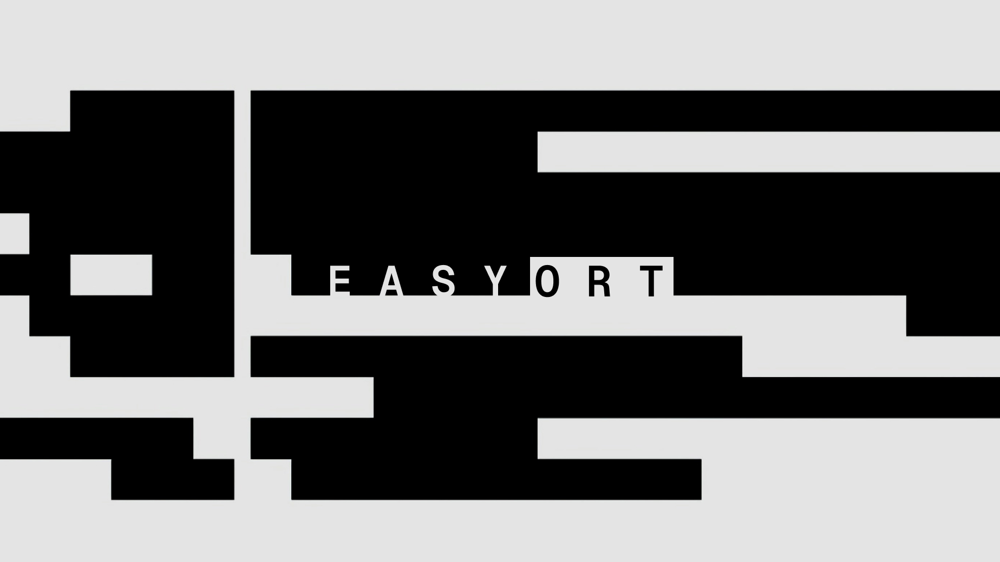

# easy-ort &middot; [](https://github.com/stratocanvas/easy-ort/actions/workflows/npm-publish.yml)  [](https://www.npmjs.com/package/@stratocanvas/easy-ort) [](https://www.npmjs.com/package/@stratocanvas/easy-ort)

A lightweight and intuitive wrapper for ONNX Runtime in Node.js. Supports object detection, image classification, and both vision/text embeddings with a clean, chainable API.

## Features
- 🚀 Fluent chainable API
- 🖼️ Batch processing for images and text
- 📊 Result visualization
- 🎯 Built-in NMS for object detection
- 🧬 Vision and text embedding support
## Installation 

```bash
npm i @stratocanvas/easy-ort
```

## Quick Examples

### Object Detection
```javascript
import EasyORT from '@stratocanvas/easy-ort'

const result = await new EasyORT()
  .detect(['person', 'car'])
  .in(imageBuffers)
  .using('./model.onnx')
  .withOptions({
    confidenceThreshold: 0.3,
    iouThreshold: 0.45,
    targetSize: [640, 640]
  })
  .andDraw()
  .now()

/* Output example:
[
  {
    "detections": [
      {
        "label": "person",
        "box": [120, 30, 50, 100],     // [x, y, width, height] in pixels
        "confidence": 0.92,             // 0-1 confidence score
        "squareness": 0.85             // Box aspect ratio (0-1)
      },
      {
        "label": "car",
        "box": [200, 150, 120, 80],
        "confidence": 0.88,
        "squareness": 0.75
      }
    ]
  }
]
*/
```

### Image Classification
```javascript
const result = await new EasyORT()
  .classify(['cat', 'dog', 'bird'])
  .in(imageBuffers)
  .using('./classifier.onnx')
  .withOptions({
    confidenceThreshold: 0.2,
    targetSize: [224, 224]
  })
  .andDraw()
  .now()

/* Output example:
[
  {
    "classifications": [
      {
        "label": "dog",
        "confidence": 0.95    // 0-1 confidence score
      },
      {
        "label": "cat",
        "confidence": 0.03
      }
    ]
  }
]
*/
```

### Text Embeddings
```javascript
const result = await new EasyORT()
  .createEmbeddingsFor('text')
  .in(['sample text', 'another text'])
  .using('./text_model.onnx')
  .withOptions({ dimension: 768 })
  .andNormalize()
  .now()

/* Output example:
[
  [0.12, -0.34, 0.56, ...],  // 768-dimensional vector for 'sample text'
  [0.23, 0.11, -0.44, ...]   // 768-dimensional vector for 'another text'
]

// With .andMerge():
[0.175, -0.115, 0.06, ...]   // Single averaged 768-dimensional vector
*/
```

### Vision Embeddings
```javascript
const result = await new EasyORT()
  .createEmbeddingsFor('vision')
  .in(imageBuffers)
  .using('./vision_model.onnx')
  .withOptions({
    dimension: 768,
    targetSize: [384, 384]
  })
  .andNormalize()
  .now()

/* Output example:
[
  [0.15, -0.28, 0.91, ...],  // 768-dimensional vector for first image
  [0.33, 0.12, -0.67, ...]   // 768-dimensional vector for second image
]

// With .andMerge():
[0.24, -0.08, 0.12, ...]     // Single averaged 768-dimensional vector
*/
```

## Batch Processing

The library automatically handles batch processing for both single and multiple inputs. Here's a utility function to load multiple images:

```typescript
import fs from 'node:fs/promises'
import path from 'node:path'
import sharp from 'sharp'

async function loadImagesAsBuffers(directoryPath: string): Promise<Buffer[]> {
  const files = await fs.readdir(directoryPath);
  const imageBuffers: Buffer[] = [];

  for (const file of files) {
    if (file.match(/\.(jpg|jpeg|png|gif|webp)$/i)) {
      const filePath = path.join(directoryPath, file);
      const buffer = await sharp(filePath)
        .toBuffer();
      imageBuffers.push(buffer);
    }
  }
  return imageBuffers;
}

// Usage example
const imageBuffers = await loadImagesAsBuffers('./images')
const result = await new EasyORT()
  .detect(['person', 'car'])
  .in(imageBuffers)  // Pass single Buffer or Buffer[] for batch processing
  .using('./model.onnx')
  .withOptions({ /* ... */ })
  .now()

// Result will be an array matching the input batch size
```

The same batch processing works for text inputs as well:

```typescript
const result = await new EasyORT()
  .createEmbeddingsFor('text')
  .in(['first text', 'second text', 'third text'])  // Single string or string[]
  .using('./text_model.onnx')
  .withOptions({ dimension: 768 })
  .now()
```

## API Reference

### Task Initialization
- `.detect(labels: string[])` - Start object detection task
- `.classify(labels: string[])` - Start image classification task
- `.createEmbeddingsFor('vision' | 'text')` - Start embedding extraction task

### Chain Methods
- `.withOptions(options)` - Set task-specific options
- `.in(inputs)` - Provide input data (Buffer[] for images, string[] for text)
- `.using(modelPath)` - Specify ONNX model path
- `.andDraw()` - Enable result visualization (detection/classification only)
- `.andNormalize()` - Enable L2 normalization (embeddings only)
- `.andMerge()` - Merge embeddings (embeddings only)
- `.now()` - Execute the task

### Options

```typescript
// Detection
{
  confidenceThreshold?: number;  // Default: 0.2
  iouThreshold?: number;        // Default: 0.45
  targetSize?: [number, number]; // Default: [384, 384]
}

// Classification
{
  confidenceThreshold?: number;  // Default: 0.2
  targetSize?: [number, number]; // Default: [384, 384]
}

// Embeddings
{
  dimension?: number;           // Default: 768
  targetSize?: [number, number]; // Default: [384, 384], vision only
}
```

## Requirements

### Models
- Single input/output nodes
- Input formats:
  - Vision: NCHW format, normalized to 0-1
  - Text: 1D token sequence
- Output formats:
  - Detection: [batch_size, num_boxes, 5 + num_classes]
  - Classification: [batch_size, num_classes]
  - Embedding: [batch_size, dimension]

### System
- Node.js environment
- Write access to `./output/` for visualization

## License

MIT
