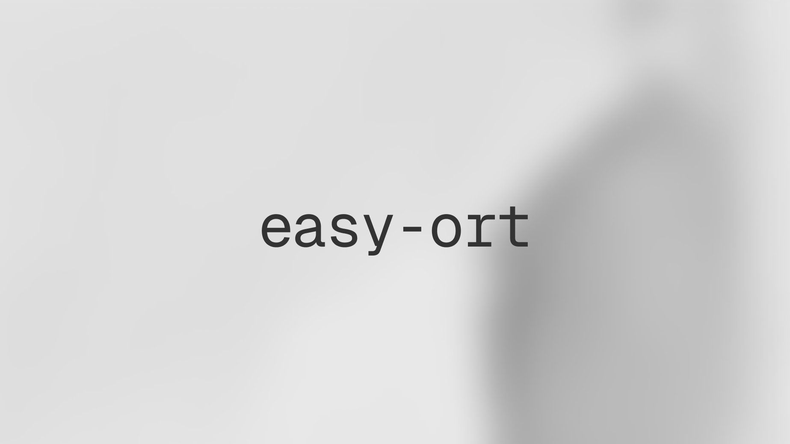

# easy-ort &middot; [](https://github.com/stratocanvas/easy-ort/actions/workflows/npm-publish.yml)  [](https://www.npmjs.com/package/@stratocanvas/easy-ort) [](https://www.npmjs.com/package/@stratocanvas/easy-ort)

A lightweight and intuitive wrapper for ONNX Runtime in Node.js. Designed for easy inference of object detection and image classification models.

## Features
- 🚀 Simple chainable API
- 🖼️ Batch processing support
- 📊 Automatic result visualization
- 🎯 Built-in NMS (Non-Maximum Suppression)
- 🔧 Flexible configuration options

## Installation 

```bash
npm i @stratocanvas/easy-ort
```

## Quick Start

```javascript
import EasyORT from '@stratocanvas/easy-ort'
import fs from 'node:fs/promises'

// Load your image(s)
const imageBuffer = await fs.readFile('./image.jpg')

// Run inference
const result = await new EasyORT()
  .data([imageBuffer])
  .model('./model.onnx')
  .draw()  // Optional: visualize results
  .run('detection', {
    labels: ['person', 'car'],
  })
```

## Usage Examples
### Object Detection

```javascript
import EasyORT from '@stratocanvas/easy-ort'

const detector = new EasyORT()
  .data(imageBuffers)
  .model('./yolo.onnx')
  .draw()  // Optional: save visualization to ./output/

const result = await detector.run('detection', {
  labels: ['person', 'car', 'dog'],
  confidenceThreshold: 0.3,  // Minimum confidence score (0-1)
  iouThreshold: 0.45,        // NMS IoU threshold (0-1)
  targetSize: [640, 640],    // Input resolution [width, height]
})

/* Result format:
[{
  "detections": [{
    "label": "person",
    "box": [x, y, width, height],  // Pixel coordinates
    "confidence": 0.92,            // 0-1 score
    "squareness": 0.85            // Box aspect ratio (0-1)
  }, ...]
}]
*/
```

### Image Classification
```javascript
import EasyORT from '@stratocanvas/easy-ort'

const classifier = new EasyORT()
  .data(imageBuffers)
  .model('./classifier.onnx')

const result = await classifier.run('classification', {
  labels: ['cat', 'dog', 'bird'],
  confidenceThreshold: 0.2,     // Minimum confidence to include
  targetSize: [224, 224],       // Input resolution [width, height]
})

/* Result format:
[{
  "classifications": [{
    "label": "dog",
    "confidence": 0.95  // 0-1 score
  }, ...]
}]
*/
```

## API Reference

### Methods
- `.data(buffers: Buffer[])`: Set input image(s)
- `.model(path: string)`: Set ONNX model path
- `.draw()`: Enable result visualization
- `.run(task, config)`: Execute inference

### Configuration

#### Detection Config
```typescript
type DetectionConfig = {
  labels: string[];                      // Class labels
  iouThreshold?: number;                 // NMS threshold (default: 0.45)
  confidenceThreshold?: number;          // Min confidence (default: 0.2)
  targetSize?: [number, number];         // Input size (default: [384, 384])
}
```

#### Classification Config
```typescript
type ClassificationConfig = {
  labels: string[];                      // Class labels
  confidenceThreshold?: number;          // Min confidence (default: 0.2)
  targetSize?: [number, number];         // Input size (default: [384, 384])
}
```

## Model Requirements
- Single input node (NCHW format)
- Single output node
  - Detection: [batch_size, num_boxes, 5 + num_classes]
  - Classification: [batch_size, num_classes]
- Input normalization: 0-1 range

## Visualization
When `.draw()` is enabled:
- Detection: Boxes and labels are drawn on images
- Classification: Top predictions are overlaid on images
- Results are saved to `./output/` directory

## Limitations

- Node.js environment only (uses `onnxruntime-node`)
- Input images must be provided as buffers
- Single input/output node models only
- Visualization requires write access to `./output/`

## License

MIT
